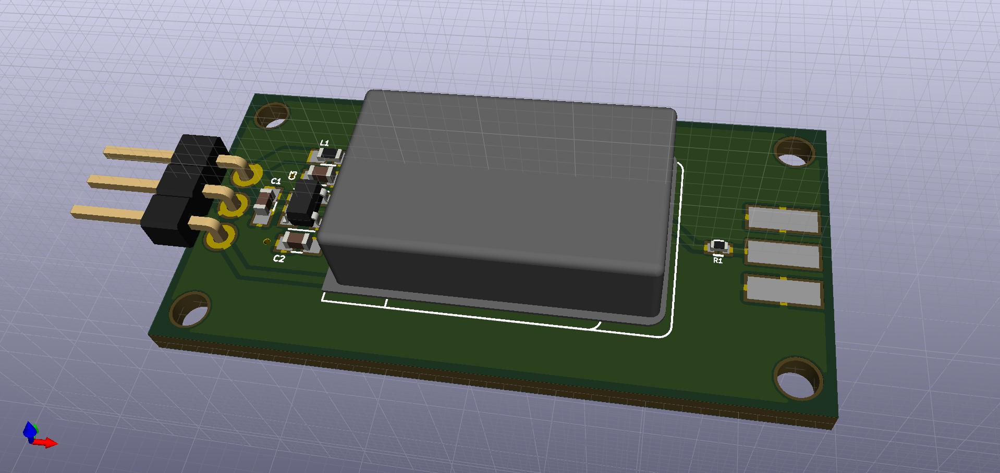
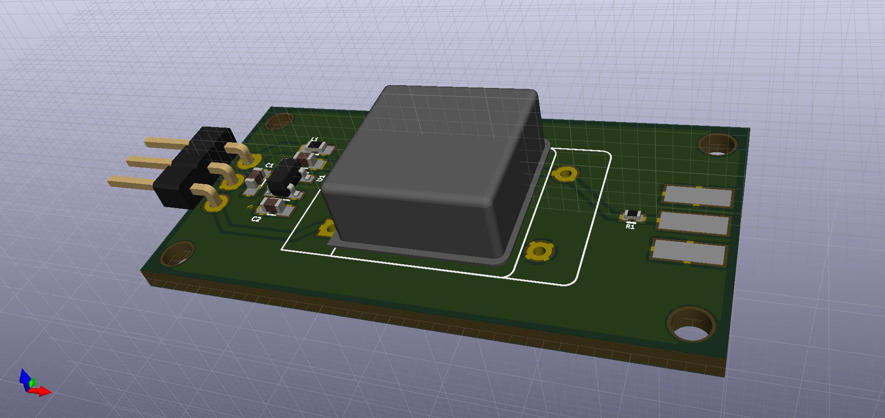
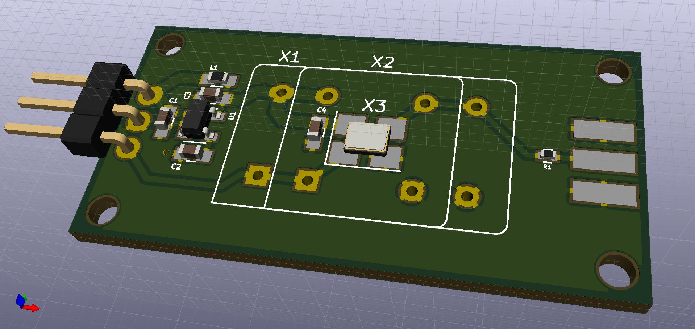
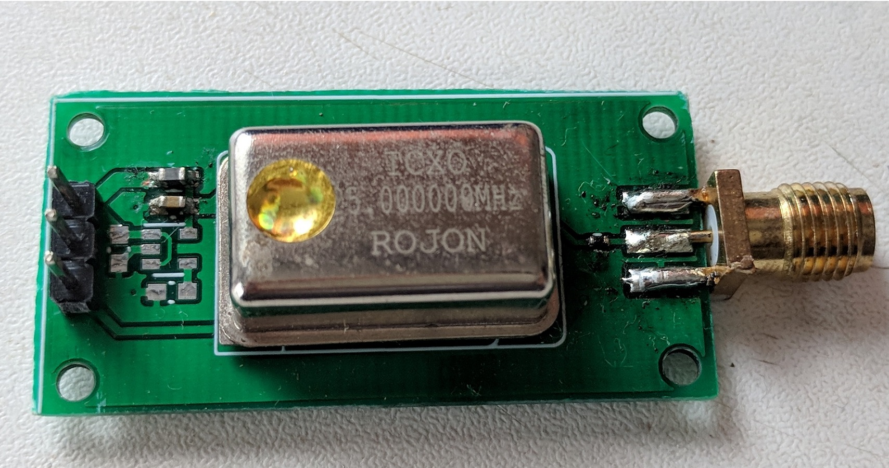

# Oscillator Breakout
A simple breakout board for oscillators. It can be populated with either DIP-14, DIP-8 or 3225 package of oscillators.

## Assembly instructions

### Power supply

| Oscillator power voltage | Parts to populate |
|-------|-----------------|
| 5V | L1 |
| 3.3V or less | C1, C2, C3 and U1 |

### Package
C4 is only needed for 3225 SMD package oscillator, it can't be populated for any DIP package.

## 3D preview
### DIP-14 package

### DIP-8 package

### 3225 package

## Assembled board
Here is an assembled board with 25 MHz TCXO, no onboard LDO, and DC coupled.

