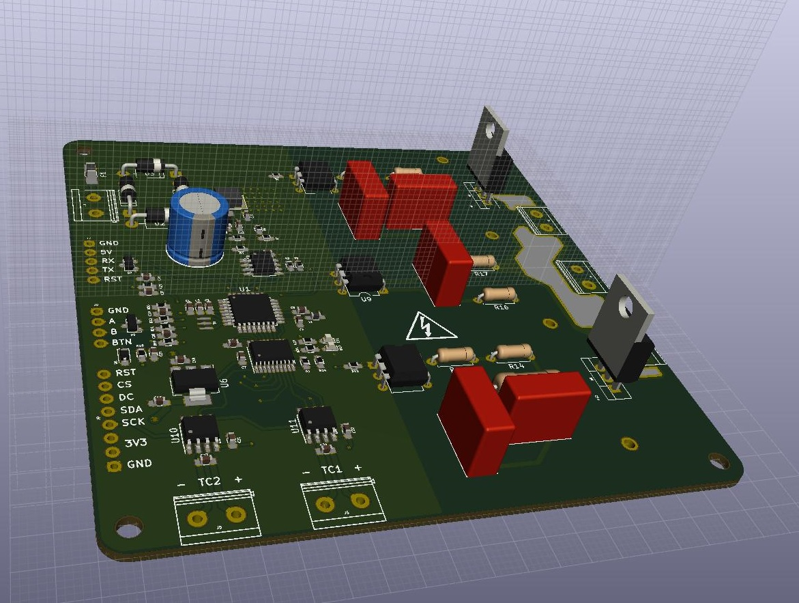

# Reflow Oven Controller
A reflow oven controller derived from [0xPIT/reflowOvenController](https://github.com/0xPIT/reflowOvenController).

**Warning: Lethal mains voltage is connected to the PCB, extreme care must be taken for the whole time. Seek help from professional technicians whenever possible.**

I decide to design my own board mainly because the solid state relay used in the original project is obsolete. In order to avoid this, I use a triac and an optocoupler to build a solid state relay. It's much easier to find alternatives for discrete components than integrate ones.

Another change from the original design is using ATmega328P to replace ATmega32U4 used in Arduino Pro Micro, this is simply because I already have some ATmega328P chips available. Note that due to this change, the Timer3 library is not available on this hardware.

### 3D preview

