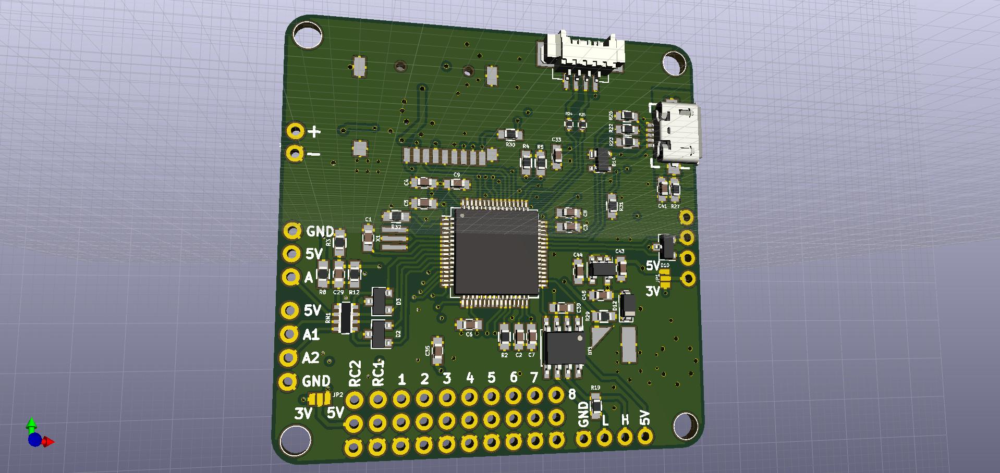
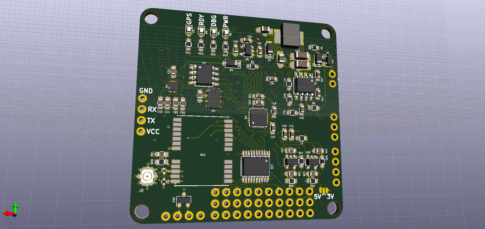
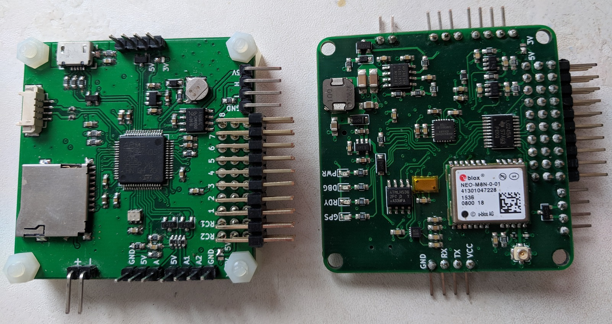

# SimpleFC
SimpleFC is a simple flight controller for drones.

## Features

- STM32F4 MCU with FPU
- 10DoF IMU (Gyro + Accel + Mag + Baro)
- Onboard UBlox GPS receiver
- DC-DC converter supports up to 6S Li-Po battery with power monitor.
- Two RC input channel with software controlled inverter for S.Bus receivers.
- 8 PWM outputs.
- Onboard TF card slot to record flight data.
- EEPROM to store parameters.
- CAN Bus support.
- USB and SWD available.

## Software
SimpleFC was originally designed to run modified version of [AutoQuad](http://autoquad.org/), the source can be found in my [fork](https://github.com/wangyeee/aq_flight_control) of AutoQuad. In additional, port for [PaparazziUAV](http://wiki.paparazziuav.org/wiki/Main_Page) is in progress. It will make SimpleFC support both fixwing and rotorcraft.

## STM32F4 resource usage
The following table summarizes usage of the MCU, details such as pinout and DMA allocation can be found in the [STM32CubeMX](https://www.st.com/en/development-tools/stm32cubemx.html) design file `SimpleFC.ioc`.

| MCU Peripheral | Usage |
|----|----|
| ADC1 | battery monitor and two analog inputs |
|CAN2 | CAN bus |
| I2C1 | [MAG3110](https://www.nxp.com/docs/en/data-sheet/MAG3110.pdf) magnetometer and EEPROM |
| SDIO | TF card slot |
| SPI1 | [ICM20689](http://www.invensense.com/wp-content/uploads/2017/08/ICM-20689-v2.2-002.pdf) gyroscope/accelerometer and [MS5611](https://www.te.com/commerce/DocumentDelivery/DDEController?Action=showdoc&DocId=Data+Sheet%7FMS5611-01BA03%7FB3%7Fpdf%7FEnglish%7FENG_DS_MS5611-01BA03_B3.pdf%7FCAT-BLPS0036) barometer |
| TIM3, TIM4, TIM12 | 8 channel PWM output |
| UART4, USART2 | RC input, support serial, S.Bus or PPM |
| USART1 | telemetry |
| USART3 | UBlox [NEO-M8N](https://www.u-blox.com/sites/default/files/NEO-M8-FW3_DataSheet_%28UBX-15031086%29.pdf) GPS receiver |
| USB | DFU or CDC telemetry |

## 3D preview and photo
Some 3D models are missing in the KiCAD render, refer to the "real word render" for more details.

Front

Back

Photo

