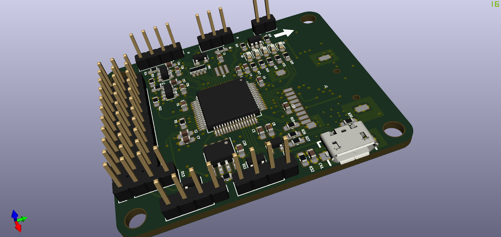
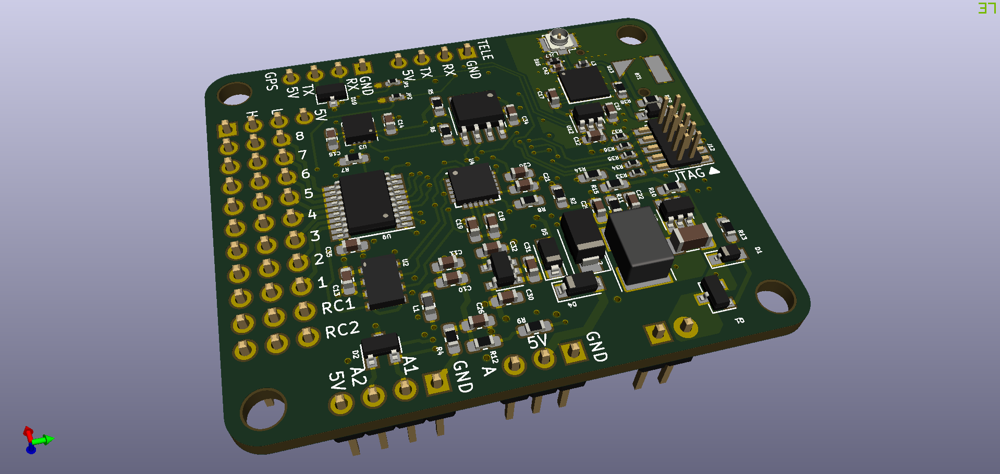

# SimpleFC_G
The SimpleFCv2 with integrated GPS receiver. Together with its 10 DoF IMU, it has full navigation capability.

***WARNING: The PCB design has not been fabricated, Use with caution!***

## Change List (compare to SimpleFCv2)

- A UBlox ZOE-M8Q GPS receiver is added while external GPS receiver can still be used by changing solder jumpers.
- The onboard DC-DC converter is now MP1470, which supports 2~3s Li-Po.

## Software
SimpleFC was originally designed to run modified version of [AutoQuad](http://autoquad.org/), the source can be found in my [fork](https://github.com/wangyeee/aq_flight_control) of AutoQuad. In additional, port for [PaparazziUAV](http://wiki.paparazziuav.org/wiki/Main_Page) is in progress. It will make SimpleFC support both fixwing and rotorcraft.

## STM32F4 resource usage
The following table summarizes usage of the MCU, details such as pinout and DMA allocation can be found in the [STM32CubeMX](https://www.st.com/en/development-tools/stm32cubemx.html) design file `SimpleFCv2.ioc` in the SimpleFCv2 folder.

| MCU Peripheral | Usage |
|----|----|
| ADC1 | battery monitor and two analog inputs |
| CAN2 | CAN bus |
| I2C1 | [MMC5883MA](https://www.memsic.com/userfiles/files/DataSheets/Magnetic-Sensors-Datasheets/MMC5883MA-RevC.pdf) magnetometer and EEPROM |
| SDIO | TF card slot |
| SPI1 | [ICM20689](http://www.invensense.com/wp-content/uploads/2017/08/ICM-20689-v2.2-002.pdf) gyroscope/accelerometer and [MS5611](https://www.te.com/commerce/DocumentDelivery/DDEController?Action=showdoc&DocId=Data+Sheet%7FMS5611-01BA03%7FB3%7Fpdf%7FEnglish%7FENG_DS_MS5611-01BA03_B3.pdf%7FCAT-BLPS0036) barometer |
| TIM3, TIM4, TIM12 | 8 channel PWM output |
| UART4, USART2 | RC input, support serial, S.Bus or PPM |
| USART1 | telemetry |
| USART3 | GPS receiver |
| USB | DFU or CDC telemetry |

## 3D preview

Front

Back

