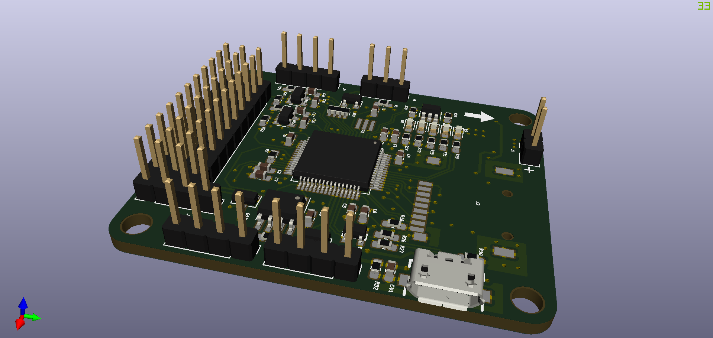
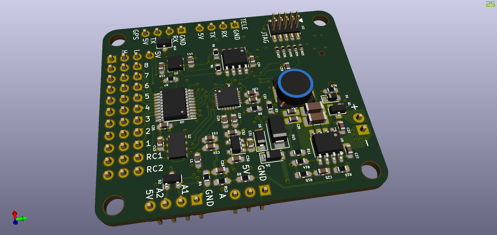

# SimpleFCv2
Version 2 of SimpleFC.

***WARNING: The PCB design has not been fabricated, Use with caution!***

## Change List

- Onboard UBlox GPS receiver has been removed to reduce PCB size.
- The 4 pin SWD connector has been replaced by 10-pin JTAG connector, with JTDI/JTDO signals available.
- Schematics libraries have been updated to latest version from the KiCAD github repo.
- One additional LED is added to the board, with 5 in total.
- Optimization of MCU pin usage, all IO pins are used in this version, refer to the following table for details.

| Pin | v1 | v2 |
|-----|----|----|
| PA4 | NC | BARO_CS |
| PA15 | MAG_INT | JTDI |
| PB3 | GPS_LED | JTDO |
| PC5 | BARO_CS | MAG_INT |
| PC14 | NC | LED2 |
| PC15 | NC | LED1 |

## Software
SimpleFC was originally designed to run modified version of [AutoQuad](http://autoquad.org/), the source can be found in my [fork](https://github.com/wangyeee/aq_flight_control) of AutoQuad. In additional, port for [PaparazziUAV](http://wiki.paparazziuav.org/wiki/Main_Page) is in progress. It will make SimpleFC support both fixwing and rotorcraft.

## STM32F4 resource usage
The following table summarizes usage of the MCU, details such as pinout and DMA allocation can be found in the [STM32CubeMX](https://www.st.com/en/development-tools/stm32cubemx.html) design file `SimpleFCv2.ioc`.

| MCU Peripheral | Usage |
|----|----|
| ADC1 | battery monitor and two analog inputs |
|CAN2 | CAN bus |
| I2C1 | [MAG3110](https://www.nxp.com/docs/en/data-sheet/MAG3110.pdf) magnetometer and EEPROM |
| SDIO | TF card slot |
| SPI1 | [ICM20689](http://www.invensense.com/wp-content/uploads/2017/08/ICM-20689-v2.2-002.pdf) gyroscope/accelerometer and [MS5611](https://www.te.com/commerce/DocumentDelivery/DDEController?Action=showdoc&DocId=Data+Sheet%7FMS5611-01BA03%7FB3%7Fpdf%7FEnglish%7FENG_DS_MS5611-01BA03_B3.pdf%7FCAT-BLPS0036) barometer |
| TIM3, TIM4, TIM12 | 8 channel PWM output |
| UART4, USART2 | RC input, support serial, S.Bus or PPM |
| USART1 | telemetry |
| USART3 | GPS receiver |
| USB | DFU or CDC telemetry |

## 3D preview

Front

Back

